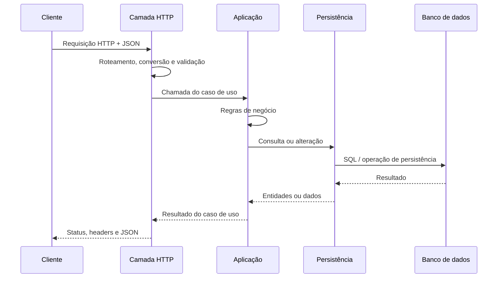
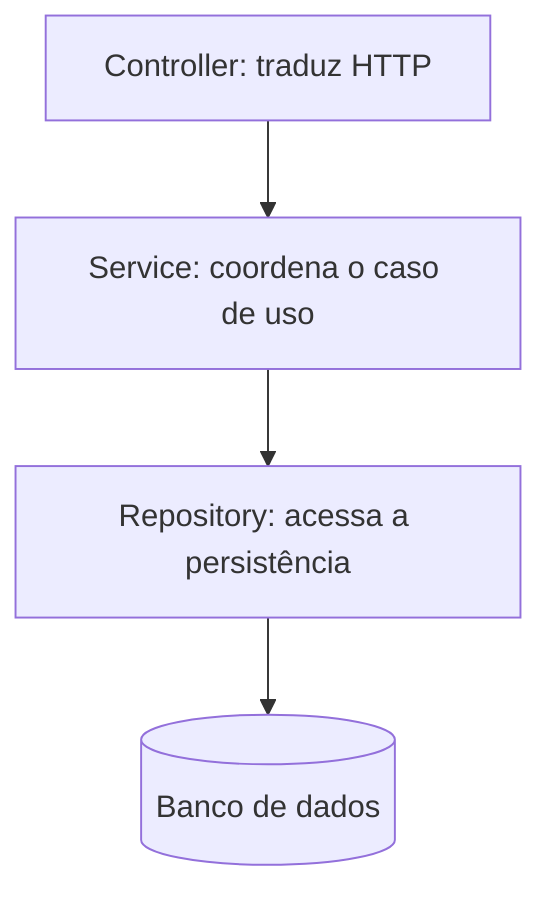
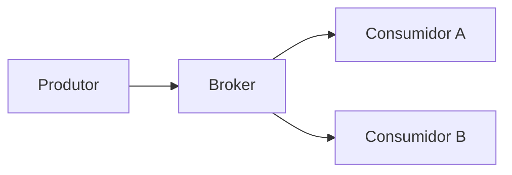
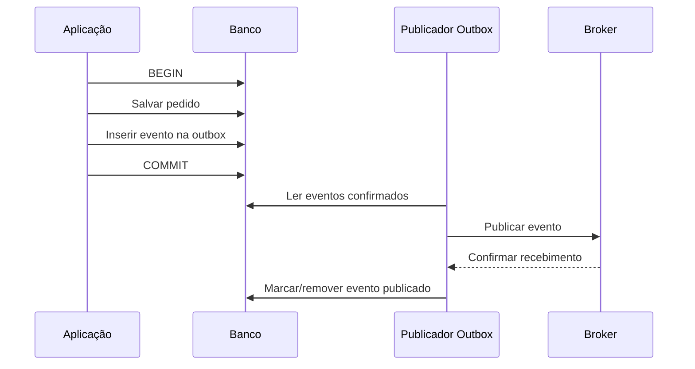

# Conteúdo de referência — Dia 1

## Fundamentos de desenvolvimento backend e visão de horizonte

Este documento desenvolve o conteúdo da
[ementa do primeiro dia](ementa-dia-1-fundamentos-backend.md). Ele foi pensado
como material de estudo e como fonte para a criação posterior dos slides do
workshop **Do Zero à Cloud**.

O texto é deliberadamente mais profundo do que a exposição de 60 minutos. Na
aula, os fundamentos devem receber mais atenção; os assuntos avançados devem
ser apresentados pelo problema que resolvem, por sua ideia central e por seus
trade-offs. O objetivo não é fazer o participante implementar microsserviços,
Outbox ou Saga no primeiro dia, mas dar a ele um mapa confiável do que existe
no horizonte do desenvolvimento backend.

As referências priorizam normas, documentação oficial, trabalhos originais e
textos técnicos de autores diretamente ligados aos conceitos apresentados.

---

## 1. O que é backend

Backend é a parte de um sistema responsável por receber entradas, aplicar
regras, consultar ou alterar dados e produzir resultados para outros
componentes. Ele normalmente não é a interface visual percebida pelo usuário,
mas sustenta o comportamento da aplicação.

Em uma aplicação web simples, é comum visualizar três partes:

```text
Frontend  <->  Backend  <->  Banco de dados
```

Essa representação é útil, mas incompleta. Um backend também pode:

- autenticar identidades e verificar permissões;
- integrar sistemas externos;
- processar arquivos;
- enviar e-mails e notificações;
- executar tarefas agendadas;
- publicar ou consumir mensagens;
- reagir a eventos;
- manter caches;
- gerar logs, métricas e rastros;
- executar processos sem qualquer interface gráfica.

Portanto, backend não é sinônimo de API REST nem de CRUD. Uma API HTTP é apenas
uma das formas de expor capacidades de um sistema.

### 1.1. Cliente e servidor são papéis

Em uma interação, o cliente inicia uma solicitação e o servidor a atende. Esses
nomes representam papéis, e não categorias fixas de programa. Um backend atua
como servidor ao responder ao frontend, mas atua como cliente quando consulta
uma API de pagamento ou publica uma mensagem em um broker. A
[RFC 9110](https://www.rfc-editor.org/rfc/rfc9110.html) define esses papéis no
contexto do HTTP.

### 1.2. Responsabilidades essenciais

Um backend costuma combinar cinco grandes responsabilidades:

1. **Comunicação:** receber e devolver dados por algum protocolo.
2. **Aplicação:** coordenar casos de uso e regras de negócio.
3. **Persistência:** manter estado além da execução do processo.
4. **Integração:** colaborar com bancos, filas e outros serviços.
5. **Operação:** ser testável, seguro, observável e confiável.

Essas responsabilidades aparecem em sistemas pequenos e grandes. O que muda é
como elas são divididas entre classes, módulos, processos e equipes.

---

## 2. O ciclo de uma requisição

Um bom modelo mental de backend começa pelo caminho completo de uma operação:



Em uma aplicação Java com Spring MVC, uma implementação possível desse fluxo é:

```text
Tomcat / Spring MVC
  -> Controller
  -> Service
  -> Repository
  -> JPA / Hibernate
  -> PostgreSQL
```

Essa cadeia não é uma lei universal. Ela é uma organização frequente porque
torna explícita a diferença entre protocolo, regra de negócio e persistência.
Controllers anotados e mapeamentos de requisição são descritos na
[documentação oficial do Spring MVC](https://docs.spring.io/spring-framework/reference/web/webmvc/mvc-controller.html).

### 2.1. Onde o tempo de uma requisição é gasto

Uma requisição não consome tempo apenas executando Java. A latência total pode
incluir:

- resolução de nome e estabelecimento de conexão;
- trânsito pela rede;
- espera em filas internas;
- desserialização do corpo;
- execução de código;
- aquisição de conexão com o banco;
- execução de consultas;
- chamadas a serviços externos;
- serialização e envio da resposta.

Essa percepção será importante mais adiante: cache, processamento assíncrono,
observabilidade e escalabilidade existem porque o caminho real é maior e mais
falível do que uma simples chamada de método.

---

## 3. HTTP, JSON e APIs

### 3.1. HTTP

HTTP é um protocolo de aplicação baseado em mensagens de requisição e resposta.
Suas semânticas atuais estão definidas na
[RFC 9110](https://www.rfc-editor.org/rfc/rfc9110.html). O protocolo oferece uma
interface uniforme para interagir com recursos sem expor como o servidor os
implementa internamente.

Uma requisição contém, conceitualmente:

```http
POST /api/tasks HTTP/1.1
Host: api.exemplo.com
Content-Type: application/json
Authorization: Bearer <token>

{
  "name": "Estudar HTTP",
  "completed": false
}
```

Seus elementos principais são:

- **método:** intenção da operação;
- **URI:** identificação do alvo;
- **headers:** metadados e controles da mensagem;
- **body:** representação enviada, quando existente.

Uma resposta contém um código de status, headers e, opcionalmente, um corpo:

```http
HTTP/1.1 201 Created
Content-Type: application/json
Location: /api/tasks/42

{
  "id": 42,
  "name": "Estudar HTTP",
  "completed": false
}
```

### 3.2. Métodos e semântica

| Método | Uso comum | Seguro | Idempotente |
|---|---|---:|---:|
| `GET` | Obter uma representação | Sim | Sim |
| `POST` | Submeter dados ou solicitar processamento | Não | Não por definição |
| `PUT` | Criar ou substituir o estado do recurso-alvo | Não | Sim |
| `PATCH` | Aplicar uma modificação parcial | Não | Depende da operação |
| `DELETE` | Remover a associação do recurso | Não | Sim |

Um método **seguro** tem semântica somente de leitura. Um método
**idempotente** pode ser repetido e produzir o mesmo efeito pretendido no
servidor que uma única execução. Isso não significa que todas as respostas
precisam ser idênticas: o primeiro `DELETE` pode responder `204`, e o seguinte,
`404`, sem deixar de ser idempotente. Segurança e idempotência são definidas na
[RFC 9110, seção 9.2](https://www.rfc-editor.org/rfc/rfc9110.html#name-common-method-properties),
e `PATCH` é definido separadamente na
[RFC 5789](https://www.rfc-editor.org/rfc/rfc5789.html).

Idempotência é importante porque redes falham. Se um cliente não recebe a
resposta, ele pode não saber se o servidor executou a operação. Repetir uma
operação idempotente é mais seguro; uma operação naturalmente não idempotente
pode exigir uma chave de idempotência ou registro de requisições já processadas.

### 3.3. Status HTTP

As famílias de status comunicam a natureza geral do resultado:

| Família | Significado |
|---:|---|
| `1xx` | Informação e continuação do protocolo |
| `2xx` | Solicitação recebida e tratada com sucesso |
| `3xx` | Redirecionamento ou uso de outra representação |
| `4xx` | A solicitação do cliente não pode ser atendida como enviada |
| `5xx` | O servidor falhou ao atender uma solicitação válida |

Alguns códigos frequentes em APIs:

| Status | Uso típico |
|---:|---|
| `200 OK` | Operação concluída com representação de resposta |
| `201 Created` | Recurso criado |
| `204 No Content` | Operação concluída sem corpo de resposta |
| `400 Bad Request` | Corpo, parâmetro ou regra de entrada inválida |
| `401 Unauthorized` | Credenciais ausentes ou inválidas |
| `403 Forbidden` | Identidade reconhecida, mas sem permissão |
| `404 Not Found` | Recurso não encontrado ou não revelado ao cliente |
| `409 Conflict` | Conflito com o estado atual do recurso |
| `422 Unprocessable Content` | Conteúdo compreendido, mas semanticamente inválido |
| `500 Internal Server Error` | Falha inesperada no servidor |
| `503 Service Unavailable` | Serviço temporariamente indisponível |

O status faz parte do contrato. Responder `200` para qualquer situação e
carregar um `success: false` no JSON desperdiça semântica que clientes,
proxies, métricas e ferramentas já entendem.

### 3.4. JSON

JSON é um formato textual e independente de linguagem para intercâmbio de
dados. Ele representa valores primitivos, objetos e arrays. A definição
normativa está na [RFC 8259](https://www.rfc-editor.org/rfc/rfc8259.html).

```json
{
  "id": "2a7aa427-38aa-4fa1-89f1-a32122a2d60f",
  "name": "Estudar backend",
  "position": 0,
  "completed": false,
  "tags": ["java", "http"]
}
```

JSON não carrega automaticamente os tipos e as regras do domínio. Uma string
pode representar um UUID, uma data ou apenas texto. O contrato precisa definir
formato, obrigatoriedade, limites e significado de cada campo.

No ecossistema Java, bibliotecas como Jackson convertem JSON em objetos e
objetos em JSON. Essa conversão não deve ser confundida com validação de
negócio: desserializar com sucesso apenas significa que o dado pôde ser
convertido.

### 3.5. API, contrato e REST

Uma API é uma interface publicada para que outro software use capacidades de um
sistema. Seu contrato inclui:

- operações disponíveis;
- caminhos e métodos;
- parâmetros e headers;
- formatos de entrada e saída;
- validações;
- status e erros;
- autenticação;
- expectativas de compatibilidade.

REST é um estilo arquitetural descrito por Roy Fielding em sua
[tese sobre arquiteturas de software baseadas em rede](https://ics.uci.edu/~fielding/pubs/dissertation/rest_arch_style.htm).
Entre suas restrições estão cliente-servidor, ausência de estado de sessão no
servidor entre requisições, cache, interface uniforme, sistema em camadas e
código sob demanda opcional.

Nesse contexto, *stateless* não significa “sem dados” ou “sem banco”. O servidor
pode manter o estado dos recursos; a restrição exige que cada requisição carregue
as informações necessárias para ser compreendida, sem depender de um contexto de
sessão oculto mantido entre duas requisições do mesmo cliente.

Na prática cotidiana, “API REST” costuma designar APIs HTTP orientadas a
recursos, com métodos e status coerentes. Contudo, REST não é apenas “JSON sobre
HTTP” nem sinônimo de CRUD. A restrição mais distintiva é a interface uniforme,
e o estilo original também trata representações e hipermídia.

Um contrato pode ser descrito por OpenAPI. A
[OpenAPI Specification](https://spec.openapis.org/oas/latest.html) define uma
descrição independente de linguagem para que pessoas e ferramentas entendam as
capacidades de uma API sem inspecionar seu código. Swagger UI é uma das
interfaces que renderizam e permitem experimentar essa descrição.

---

## 4. Organização interna de um backend

### 4.1. Separar responsabilidades

Separar responsabilidades ajuda a responder três perguntas:

1. Onde o protocolo HTTP é interpretado?
2. Onde as regras e casos de uso são executados?
3. Onde os dados são consultados ou alterados?

Uma organização frequente é:



#### Controller

- mapeia rota, método e status;
- lê path, query, headers e body;
- solicita validação estrutural;
- converte o resultado da aplicação em resposta HTTP;
- não deveria concentrar regras de negócio.

#### Service ou camada de aplicação

- representa casos de uso;
- coordena regras e dependências;
- verifica invariantes do domínio;
- define fronteiras transacionais;
- não deveria depender de detalhes desnecessários de HTTP.

#### Repository

- expressa operações de persistência;
- consulta e salva entidades;
- esconde parte dos detalhes de JDBC, JPA ou outra tecnologia;
- não deveria decidir regras de negócio.

Essa separação não exige criar uma interface para toda classe nem uma camada
para cada método. O objetivo é clareza de responsabilidades, não quantidade de
arquivos.

### 4.2. Dependências e testabilidade

Uma classe mais interna não deve precisar saber que foi chamada por HTTP. Isso
permite acionar o mesmo caso de uso por um endpoint, uma tarefa agendada ou uma
mensagem.

Em Java, a injeção por construtor deixa dependências visíveis e facilita testes:

```java
public final class CompleteTaskService {
    private final TaskRepository repository;

    public CompleteTaskService(TaskRepository repository) {
        this.repository = repository;
    }

    public Task complete(UUID taskId) {
        Task task = repository.findById(taskId)
                .orElseThrow(() -> new TaskNotFoundException(taskId));
        task.complete();
        return repository.save(task);
    }
}
```

O framework pode fornecer a implementação concreta do repository, mas a regra
permanece expressa em Java e pode ser testada isoladamente.

### 4.3. Entidades e DTOs

Uma entidade de persistência representa como dados são mantidos e relacionados.
Um DTO representa dados que cruzam uma fronteira, como a entrada ou a resposta
de uma API.

Usar a mesma classe para os dois papéis parece simples, mas acopla o contrato
público ao modelo de persistência. Isso pode:

- expor campos internos;
- permitir que o cliente altere dados gerenciados pelo servidor;
- causar ciclos ou carregamentos inesperados na serialização;
- transformar uma mudança de banco em quebra de API;
- dificultar formatos diferentes para criação, atualização e resposta.

Um `record` Java é conveniente para contratos imutáveis:

```java
public record CreateTaskRequest(
        String name,
        Integer position,
        Instant dueDate
) {}

public record TaskResponse(
        UUID id,
        String name,
        Integer position,
        Instant createdAt,
        Instant dueDate,
        boolean completed
) {}
```

A própria documentação do Spring recomenda objetos dedicados e, quando
possível, imutáveis para restringir o binding de entradas não confiáveis; veja
[Spring MVC Data Binding](https://docs.spring.io/spring-framework/reference/web/webmvc/mvc-data-binding.html).

### 4.4. Validação em camadas

Há pelo menos três tipos de validação:

1. **Conversão:** o valor pode ser convertido para o tipo esperado?
2. **Estrutural:** o campo é obrigatório, possui tamanho e formato válidos?
3. **Negócio:** a operação respeita o estado e as regras do domínio?

Exemplos:

| Situação | Tipo de validação |
|---|---|
| `"abc"` recebido como UUID | Conversão |
| Nome vazio | Estrutural |
| Prazo anterior à criação | Negócio |
| Criar tarefa para coluna inexistente | Negócio/persistência |
| Mover tarefa sem permissão | Autorização |

Jakarta Validation oferece constraints declarativas sobre objetos, parâmetros e
retornos; sua finalidade é descrita na
[especificação Jakarta Validation 3.1](https://jakarta.ee/specifications/bean-validation/3.1/jakarta-validation-spec-3.1.html).
No Spring MVC, `@Valid` pode ser aplicado ao `@RequestBody`, conforme a
[documentação de validação do Spring MVC](https://docs.spring.io/spring-framework/reference/web/webmvc/mvc-controller/ann-validation.html).

Validações declarativas não substituem regras de negócio. `@NotBlank` sabe que
uma string não deve estar vazia; ele não sabe se uma transição de estado faz
sentido para a empresa.

### 4.5. Erros como parte do contrato

Erros devem ser previsíveis para pessoas e programas. A
[RFC 9457](https://www.rfc-editor.org/rfc/rfc9457.html) define o formato
“Problem Details for HTTP APIs”, com campos como `type`, `title`, `status`,
`detail` e `instance`.

```json
{
  "type": "about:blank",
  "title": "Recurso não encontrado",
  "status": 404,
  "detail": "Tarefa 42 não encontrada",
  "instance": "/api/tasks/42"
}
```

Um formato padronizado evita que cada endpoint invente sua própria resposta. O
Spring possui suporte direto a `ProblemDetail` e `ErrorResponse`, documentado em
[Spring MVC Error Responses](https://docs.spring.io/spring-framework/reference/web/webmvc/mvc-ann-rest-exceptions.html).

Respostas públicas não devem carregar stack traces, credenciais, SQL ou detalhes
internos. A própria RFC 9457 alerta para o risco de expor informações úteis a
ataques.

---

## 5. Dados, estado e persistência

### 5.1. Memória não é persistência

Objetos Java existem na memória do processo. Se o processo termina, essa memória
é liberada. Persistência permite reconstruir o estado necessário após reinício,
falha ou movimentação da aplicação para outra máquina.

Persistir não significa necessariamente usar um banco relacional. Arquivos,
bancos de documentos, chave-valor, séries temporais, grafos e logs de eventos
atendem necessidades distintas. A escolha deve partir dos requisitos de acesso,
consistência, volume e operação.

### 5.2. Modelo relacional

Em um banco relacional, dados são organizados em relações representadas por
tabelas. Chaves primárias identificam registros; chaves estrangeiras expressam
referências; constraints protegem invariantes que o próprio banco consegue
avaliar.

Exemplo simplificado:

```text
boards
  id (PK)
  name

columns
  id (PK)
  board_id (FK -> boards.id)
  name
  position

tasks
  id (PK)
  column_id (FK -> columns.id)
  name
  completed
```

O banco não é apenas um lugar para guardar objetos. Ele possui seu próprio
modelo, linguagem de consulta, índices, constraints, concorrência e regras
transacionais.

### 5.3. Transações e ACID

Uma transação agrupa operações em uma unidade de trabalho. As propriedades ACID
são normalmente resumidas como:

- **Atomicidade:** todas as operações confirmam ou nenhuma confirma;
- **Consistência:** uma transação válida preserva as invariantes definidas;
- **Isolamento:** transações concorrentes não devem produzir interferências
  proibidas pelo nível escolhido;
- **Durabilidade:** após o commit, o resultado deve sobreviver a falhas cobertas
  pelo sistema de persistência.

```sql
BEGIN;

UPDATE accounts SET balance = balance - 100 WHERE id = 1;
UPDATE accounts SET balance = balance + 100 WHERE id = 2;

COMMIT;
```

Se a segunda alteração falhar, a primeira não deve permanecer isoladamente. A
[documentação de transações do PostgreSQL](https://www.postgresql.org/docs/current/tutorial-transactions.html)
explica `BEGIN`, `COMMIT`, `ROLLBACK` e savepoints. Os níveis de isolamento e o
que uma transação pode observar durante concorrência são descritos em
[Transaction Isolation](https://www.postgresql.org/docs/current/transaction-iso.html).

A fronteira transacional costuma acompanhar um caso de uso, não cada chamada de
repository isoladamente. O Spring oferece uma abstração consistente para JDBC,
Hibernate e JPA e suporta transações declarativas; veja
[Spring Transaction Management](https://docs.spring.io/spring-framework/reference/data-access/transaction.html).

### 5.4. ORM, JPA e Hibernate

ORM mapeia objetos e relações do código para estruturas relacionais. No
ecossistema Java:

- **JPA/Jakarta Persistence** define uma especificação;
- **Hibernate** é uma implementação comum dessa especificação;
- **Spring Data JPA** adiciona uma abstração de repositories e reduz código
  repetitivo.

A [documentação do Spring Data JPA](https://docs.spring.io/spring-data/jpa/reference/)
descreve seu suporte a repositories JPA.

ORM reduz trabalho mecânico, mas não elimina a necessidade de compreender SQL e
bancos. Problemas como consultas em excesso, relacionamentos carregados no
momento errado, transações longas e falta de índices continuam existindo.

---

## 6. Segurança básica e CORS

### 6.1. Dados de entrada não são confiáveis

Qualquer entrada externa pode estar incorreta ou ser maliciosa. Isso inclui
JSON, parâmetros, headers, arquivos, mensagens e respostas de outros serviços.

Uma postura inicial de segurança inclui:

- validar formato, tamanho e domínio dos valores;
- autenticar quem solicita;
- autorizar a operação sobre o recurso específico;
- evitar retornar dados além do necessário;
- não registrar tokens, senhas e segredos;
- usar queries parametrizadas;
- limitar consumo abusivo de recursos;
- manter dependências atualizadas;
- não confiar automaticamente em APIs externas.

O [OWASP API Security Top 10](https://owasp.org/API-Security/editions/2023/en/0x10-api-security-risks/)
é um mapa de riscos como falhas de autorização em objetos, autenticação
incorreta, consumo irrestrito de recursos, configurações inseguras e consumo
inseguro de outras APIs.

### 6.2. Autenticação e autorização

- **Autenticação:** verificar quem é o solicitante.
- **Autorização:** verificar o que essa identidade pode fazer.

Uma pessoa autenticada não está automaticamente autorizada a ler ou alterar
qualquer registro. APIs que recebem IDs em rotas precisam verificar permissão
sobre o objeto, e não apenas a presença de um token.

### 6.3. Origem e política de mesma origem

Para o navegador, uma origem é formada pelo conjunto:

```text
esquema + host + porta
```

Exemplos:

```text
http://localhost:5173  !=  http://localhost:8090
https://app.exemplo.com != https://api.exemplo.com
```

Mesmo que os dois primeiros endereços apontem para a mesma máquina, portas
diferentes formam origens diferentes.

### 6.4. CORS

CORS, ou Cross-Origin Resource Sharing, é um protocolo sobre HTTP pelo qual a
resposta declara se pode ser compartilhada com uma origem diferente. A definição
normativa está no [Fetch Standard da WHATWG](https://fetch.spec.whatwg.org/#http-cors-protocol).

Uma resposta pode incluir, por exemplo:

```http
Access-Control-Allow-Origin: https://app.exemplo.com
Access-Control-Allow-Methods: GET, POST, PUT, DELETE
Access-Control-Allow-Headers: Content-Type, Authorization
```

Para certas requisições, o navegador envia antes um **preflight** com `OPTIONS`:

```http
OPTIONS /api/tasks HTTP/1.1
Origin: https://app.exemplo.com
Access-Control-Request-Method: POST
Access-Control-Request-Headers: content-type
```

O servidor responde indicando se permite aquela origem, método e headers. Só
então o navegador decide enviar a requisição principal.

Pontos essenciais:

- CORS é aplicado principalmente pelo navegador;
- `curl`, Postman ou outro servidor não são impedidos por CORS;
- CORS não autentica e não autoriza usuários;
- liberar `*` pode ser aceitável em uma API pública sem credenciais, mas não é
  uma política geral segura;
- requisições com credenciais exigem configuração mais restritiva;
- um erro de CORS frequentemente é uma resposta bloqueada pelo navegador, não
  necessariamente uma API fora do ar.

---

## 7. Testes automatizados

Testes automatizados executam verificações repetíveis sobre o comportamento do
sistema. Eles não provam ausência de defeitos, mas reduzem o custo de descobrir
regressões e tornam mudanças mais seguras.

### 7.1. Níveis de teste

| Tipo | Escopo | Pergunta principal |
|---|---|---|
| Unitário | Uma unidade pequena e suas dependências controladas | A regra funciona isoladamente? |
| Integração | Duas ou mais partes reais | O código integra corretamente com framework, banco ou serviço? |
| Controller/contrato | Interface HTTP | Rota, status, validação e JSON estão corretos? |
| Ponta a ponta | Sistema executando como um todo | O fluxo do usuário funciona? |

Os nomes variam entre equipes. O mais importante é declarar com clareza quais
fronteiras são reais e quais foram substituídas.

A “pirâmide de testes” é uma heurística: muitos testes pequenos e rápidos,
alguns testes de integração e poucos testes amplos e caros. Uma discussão
prática da ideia está em
[The Practical Test Pyramid](https://martinfowler.com/articles/practical-test-pyramid.html).

### 7.2. Arrange, Act, Assert

Um teste pode ser lido em três momentos:

1. **Arrange:** preparar dados e dependências;
2. **Act:** executar o comportamento;
3. **Assert:** verificar o resultado observável.

```java
@Test
void shouldRejectTaskWhenColumnDoesNotExist() {
    // Arrange
    UUID columnId = UUID.randomUUID();
    when(columnRepository.findById(columnId)).thenReturn(Optional.empty());

    // Act + Assert
    assertThrows(
            ResourceNotFoundException.class,
            () -> taskService.create(columnId, validRequest())
    );
}
```

JUnit fornece o modelo de execução e as assertions. Sua referência oficial é o
[JUnit User Guide](https://docs.junit.org/current/user-guide/). Mockito permite
criar doubles, configurar respostas e verificar interações; veja a
[documentação oficial do Mockito](https://site.mockito.org/).

### 7.3. Mocks

Um mock substitui uma dependência para controlar o cenário e observar
interações. Ele é útil para isolar uma regra, mas o excesso pode acoplar o teste
a detalhes de implementação.

Um bom teste unitário verifica comportamento relevante:

- resultado retornado;
- mudança de estado;
- exceção de negócio;
- colaboração importante com uma dependência.

Ele não precisa verificar cada chamada interna sem impacto no contrato.

### 7.4. Testes HTTP em Java

MockMvc executa o fluxo do Spring MVC com requests e responses simulados, sem
subir um servidor HTTP real. Ele permite verificar roteamento, conversão,
validação, tratamento de exceções, status e JSON. O escopo está descrito na
[documentação oficial do MockMvc](https://docs.spring.io/spring-framework/reference/testing/mockmvc.html).

Um teste de integração com banco cobre problemas que mocks de repositories não
encontram, como mapeamentos JPA, constraints, queries e comportamento
transacional. Por outro lado, ele é mais lento e exige infraestrutura ou um
banco temporário.

### 7.5. Teste manual continua útil

Swagger UI, `curl`, Postman e a auditoria visual do frontend são valiosos para
exploração e diagnóstico. A diferença é que um procedimento manual depende de
uma pessoa lembrar e repetir os passos; uma suíte automatizada vira uma rede de
segurança executável.

---

## 8. Evolução arquitetural

Arquitetura é o conjunto de estruturas e decisões que moldam um sistema e seus
trade-offs. Não existe uma arquitetura universalmente superior. A solução deve
ser proporcional ao domínio, à equipe, ao volume, à necessidade de mudança e à
capacidade operacional.

### 8.1. Monólito

Um monólito é implantado como uma unidade. Isso não significa necessariamente
código desorganizado.

Vantagens frequentes:

- execução local simples;
- chamadas dentro do mesmo processo;
- uma implantação;
- transações locais mais diretas;
- testes ponta a ponta menos distribuídos;
- menor custo operacional inicial.

Riscos quando cresce sem limites claros:

- acoplamento entre áreas;
- mudanças com impacto amplo;
- implantação conjunta de tudo;
- dificuldade para entender propriedade de módulos;
- escala da aplicação inteira mesmo quando apenas uma parte precisa.

### 8.2. Monólito modular

Um monólito modular continua sendo uma única unidade de implantação, mas possui
fronteiras internas explícitas. Módulos escondem seus detalhes e colaboram por
interfaces definidas.

Ele preserva simplicidade operacional enquanto cria disciplina arquitetural.
Também permite aprender os limites do domínio antes de transformá-los em
fronteiras de rede. Martin Fowler discute essa estratégia em
[Monolith First](https://martinfowler.com/bliki/MonolithFirst.html).

### 8.3. Microsserviços

Uma arquitetura de microsserviços organiza uma aplicação como serviços
implantáveis de forma independente, normalmente orientados a capacidades de
negócio. A caracterização clássica de James Lewis e Martin Fowler está em
[Microservices](https://martinfowler.com/articles/microservices.html).

Potenciais benefícios:

- implantação independente;
- escala independente;
- isolamento de algumas falhas;
- autonomia de times;
- limites técnicos mais explícitos;
- possibilidade de tecnologias diferentes quando justificado.

Custos:

- chamadas de rede são mais lentas e falham;
- observabilidade precisa correlacionar vários processos;
- contratos precisam evoluir sem quebrar consumidores;
- testes e ambientes ficam mais complexos;
- dados e transações atravessam fronteiras;
- deploy, configuração e segurança se multiplicam;
- uma divisão ruim cria um monólito distribuído.

A
[visão de microsserviços do Azure Architecture Center](https://learn.microsoft.com/en-us/azure/architecture/microservices/)
também enfatiza que os benefícios vêm acompanhados de complexidade em
descoberta, consistência, transações, comunicação e operação.

### 8.4. Comparação resumida

| Aspecto | Monólito modular | Microsserviços |
|---|---|---|
| Implantação | Unidade única | Várias unidades independentes |
| Comunicação | Chamadas em processo | Rede e/ou mensageria |
| Transações | Locais mais simples | Frequentemente distribuídas |
| Observabilidade | Centralizada | Precisa de correlação distribuída |
| Escala | Normalmente da aplicação | Por serviço |
| Autonomia | Fronteiras por disciplina | Fronteiras técnicas e organizacionais |
| Custo inicial | Menor | Maior |

O tamanho não define sozinho um microsserviço. Fronteira de negócio,
independência e responsabilidade operacional são mais importantes que número de
classes ou linhas de código.

---

## 9. Comunicação síncrona, mensageria e eventos

### 9.1. Comunicação síncrona

Em uma interação síncrona, quem chama aguarda o resultado para continuar:

```text
Serviço A -> HTTP -> Serviço B
Serviço A <- resposta <- Serviço B
```

É simples de entender e adequado quando o resultado é necessário imediatamente.
Entretanto, disponibilidade e latência de B afetam A. Cadeias A → B → C → D
amplificam atraso e falhas.

### 9.2. Comunicação assíncrona

Em mensageria, o produtor entrega uma mensagem a um intermediário, e o consumidor
pode processá-la depois:



Conceitos básicos:

- **produtor/publisher:** envia a mensagem;
- **broker:** recebe, armazena e encaminha conforme o modelo;
- **consumidor/subscriber:** processa a mensagem;
- **fila:** distribui trabalho, normalmente para um consumidor do grupo;
- **tópico/pub-sub:** permite que diferentes assinantes recebam o evento;
- **acknowledgement:** confirmação de recebimento ou processamento.

RabbitMQ documenta acknowledgements de consumidores e confirmações de
publishers como mecanismos distintos e necessários para segurança de dados;
veja
[Consumer Acknowledgements and Publisher Confirms](https://www.rabbitmq.com/docs/confirms).

### 9.3. Comando e evento

- **Comando:** solicita que um destinatário execute uma ação, como
  `ReserveInventory`.
- **Evento:** anuncia algo que já aconteceu, como `OrderCreated`.

Um comando costuma expressar intenção e possuir destino. Um evento expressa um
fato passado e não deveria exigir que um consumidor específico exista. O guia de
[opções de mensageria do Azure Architecture Center](https://learn.microsoft.com/en-us/azure/architecture/guide/technology-choices/messaging)
distingue esses dois tipos de mensagem.

### 9.4. Arquitetura orientada a eventos

Em uma arquitetura orientada a eventos, produtores publicam fatos e consumidores
reagem a eles. O produtor não precisa conhecer todos os consumidores. Esse
desacoplamento facilita adicionar reações, mas torna o fluxo global menos
explícito.

A descrição formal do estilo no
[Azure Architecture Center](https://learn.microsoft.com/pt-br/azure/architecture/guide/architecture-styles/event-driven)
identifica produtores, canais e consumidores como elementos principais.

Benefícios possíveis:

- desacoplamento temporal;
- processamento em segundo plano;
- absorção de picos;
- vários consumidores para o mesmo fato;
- replay quando a tecnologia mantém o histórico;
- escala independente de consumidores.

Custos:

- consistência eventual;
- depuração de fluxo distribuído;
- ordenação parcial;
- duplicidade;
- schemas de eventos precisam evoluir;
- tratamento de mensagens problemáticas;
- observabilidade e correlação se tornam indispensáveis.

### 9.5. Entrega, retries e duplicidade

Em sistemas distribuídos, falha e timeout produzem incerteza. Um consumidor pode
terminar o trabalho e cair antes de confirmar. O broker então entrega novamente.

Modelos conceituais:

| Modelo | Consequência possível |
|---|---|
| No máximo uma vez | Pode perder mensagem, evita redelivery pelo broker |
| Pelo menos uma vez | Evita perda em certos cenários, pode duplicar |
| Exatamente uma vez | Exige definir cuidadosamente o escopo e as operações cobertas |

“Exactly once” não é uma propriedade mágica de todo o processo de negócio. Um
broker pode oferecer garantias dentro de seu próprio log ou transação, enquanto
um e-mail, cobrança ou banco externo permanece fora desse limite.

Para processamento confiável, normalmente são necessários:

- confirmação após concluir o efeito necessário;
- retry com limite e backoff;
- dead-letter queue para mensagens que não progridem;
- identificador estável da mensagem;
- consumidor idempotente;
- métricas e alertas de backlog e falhas.

A documentação de confiabilidade do RabbitMQ explica que acknowledgements dão
entrega “pelo menos uma vez” e que redelivery precisa ser esperado; veja
[RabbitMQ Reliability Guide](https://www.rabbitmq.com/docs/reliability).

### 9.6. Idempotência no consumidor

Um consumidor idempotente reconhece que já processou uma mensagem ou executa uma
operação cujo efeito repetido não altera novamente o resultado.

Uma estratégia simplificada usa o ID da mensagem:

```text
iniciar transação
  se message_id já foi processado:
      encerrar sem repetir o efeito
  aplicar mudança de negócio
  registrar message_id como processado
confirmar transação
enviar acknowledgement
```

O registro da mensagem e o efeito de negócio precisam compartilhar uma
fronteira atômica quando possível; caso contrário, reaparece um problema de
escrita dupla.

---

## 10. Cache

Cache mantém uma cópia de dados para atender acessos futuros com menor custo.
Pode reduzir latência e carga no banco ou em outro serviço.

### 10.1. Cache local e distribuído

| Tipo | Exemplo | Vantagem | Limitação |
|---|---|---|---|
| Local | Caffeine na JVM | Muito rápido, sem rede | Cada instância possui sua própria cópia |
| Distribuído | Redis | Compartilhado entre instâncias | Adiciona rede e infraestrutura |

Caffeine oferece políticas de expiração e remoção por tamanho, tempo e
referência; veja sua
[documentação de eviction](https://github.com/ben-manes/caffeine/wiki/Eviction).

### 10.2. Cache-aside

Fluxo de leitura:

```text
1. Consultar cache
2. Se houver valor, devolver
3. Se não houver, consultar fonte principal
4. Armazenar o resultado no cache com TTL
5. Devolver
```

Fluxo de escrita frequente:

```text
1. Atualizar fonte principal
2. Invalidar a chave do cache
3. Próxima leitura repopula o cache
```

A estratégia é detalhada na documentação oficial de
[cache-aside do Redis](https://redis.io/docs/latest/develop/use-cases/cache-aside/).

### 10.3. Conceitos importantes

- **cache hit:** o valor foi encontrado;
- **cache miss:** foi necessário consultar a fonte;
- **TTL:** tempo máximo programado para a entrada permanecer;
- **eviction:** remoção por política de capacidade ou expiração;
- **invalidation:** remoção porque a fonte mudou;
- **staleness:** valor temporariamente desatualizado;
- **hit rate:** proporção de leituras atendidas pelo cache.

### 10.4. O custo escondido

Cache cria outra cópia do estado. O problema difícil não é colocar dados nele,
mas decidir quando a cópia deixou de ser válida.

Falhas comuns:

- TTL longo demais serve dados antigos;
- TTL curto demais reduz o benefício;
- atualização do banco sem invalidação;
- várias instâncias com caches locais divergentes;
- **cache stampede:** muitas requisições consultam a fonte ao mesmo tempo quando
  uma chave popular expira;
- usar cache como fonte definitiva sem ter projetado durabilidade.

Cache deve ser introduzido a partir de uma necessidade medida, não como
ornamento arquitetural.

---

## 11. Consistência em sistemas distribuídos

Dentro de um único banco relacional, uma transação pode tornar várias alterações
atômicas. Quando uma operação envolve bancos e serviços independentes, essa
fronteira desaparece.

### 11.1. Consistência forte e eventual

Em uma visão simplificada:

- **consistência forte:** uma leitura após a confirmação observa o estado
  confirmado esperado dentro da garantia definida;
- **consistência eventual:** réplicas ou serviços podem divergir por um período,
  mas convergem se novas alterações cessarem e o processamento continuar.

Consistência eventual não significa ausência de regras. O sistema precisa
definir quais estados intermediários são aceitáveis, como o usuário os percebe e
como detectar operações que não convergiram.

### 11.2. O problema da escrita dupla

Considere:

```text
1. Salvar pedido no banco
2. Publicar evento OrderCreated
```

Falhas possíveis:

- o banco confirma e a publicação falha: existe pedido sem evento;
- o evento é publicado e a transação do banco falha: consumidores reagem a um
  pedido inexistente;
- a publicação ocorre, mas a confirmação se perde: retry pode duplicar o evento.

Não há uma linha de Java capaz de tornar atomicamente uma transação local do
banco e uma operação independente no broker sem um protocolo ou padrão
adicional.

### 11.3. Transactional Outbox

O Outbox resolve a primeira parte do problema registrando a mudança de negócio e
a intenção de publicar na mesma transação local.



Ideia central:

```text
Mesma transação local:
  alteração de negócio + registro da outbox

Processo posterior:
  outbox -> broker
```

A
[documentação do Transactional Outbox da AWS](https://docs.aws.amazon.com/prescriptive-guidance/latest/cloud-design-patterns/transactional-outbox.html)
descreve o problema de dual write, a tabela de outbox, a alternativa com Change
Data Capture e a necessidade de consumidores idempotentes.

O Outbox garante que a intenção de publicar acompanha o commit local, mas não
elimina todos os problemas:

- o publicador pode enviar e cair antes de marcar como enviado;
- o mesmo evento pode ser publicado mais de uma vez;
- ordenação precisa ser projetada por agregado ou chave;
- a tabela precisa de retenção e monitoramento;
- consumidores ainda precisam lidar com duplicidade.

### 11.4. Saga

Na aplicação moderna do padrão, Saga trata um processo de negócio que atravessa
múltiplas transações locais, frequentemente em serviços e bancos diferentes.
Exemplo:

```text
Criar pedido
  -> reservar estoque
  -> processar pagamento
  -> solicitar entrega
```

Se o pagamento falha após a reserva, não existe um `ROLLBACK` único que alcance
todos os bancos. Uma ação compensatória pode liberar o estoque.

A ideia original foi apresentada por Hector Garcia-Molina e Kenneth Salem no
artigo [Sagas](https://www.cs.cornell.edu/andru/cs711/2002fa/reading/sagas.pdf),
de 1987: uma transação longa pode ser decomposta em transações menores com ações
de compensação. O uso entre microsserviços é uma adaptação posterior dessa ideia
para fronteiras distribuídas.

#### Orquestração

Um coordenador explícito determina os passos:

```text
Orquestrador
  -> Pedido: criar
  -> Estoque: reservar
  -> Pagamento: cobrar
  -> Entrega: solicitar
```

Se algo falha, o orquestrador aciona compensações. Vantagens: fluxo mais visível
e estado central do processo. Custos: o coordenador ganha responsabilidade e
precisa ser altamente confiável.

#### Coreografia

Cada serviço reage a eventos:

```text
OrderCreated
  -> InventoryReserved
     -> PaymentApproved
        -> DeliveryRequested
```

Vantagens: menos coordenação central e maior autonomia. Custos: o fluxo completo
fica espalhado, ciclos e dependências podem ser difíceis de perceber, e a
observabilidade se torna crítica.

#### Compensar não é voltar no tempo

Compensação é uma nova operação de negócio. Estornar um pagamento não apaga o
fato de que ele ocorreu; pode haver taxas, auditoria e efeitos externos. Nem toda
ação é perfeitamente reversível, como enviar um e-mail. A modelagem precisa
considerar isso antes de escolher o padrão.

O guia de
[Saga Orchestration da AWS](https://docs.aws.amazon.com/prescriptive-guidance/latest/cloud-design-patterns/saga-orchestration.html)
destaca consistência eventual, idempotência, falta de isolamento, complexidade e
observabilidade como preocupações do padrão.

---

## 12. O restante do horizonte

Os conceitos abaixo não precisam ser aprofundados no primeiro dia, mas ajudam a
mostrar que operar backend envolve mais que implementar funcionalidades.

### 12.1. Concorrência

Um servidor atende múltiplas solicitações. Threads compartilham memória dentro
do processo, o que é eficiente, mas pode gerar condições de corrida e problemas
de visibilidade. Bancos também executam transações concorrentes. Locks, níveis
de isolamento, estruturas imutáveis e operações atômicas ajudam a controlar
esses efeitos.

A introdução oficial da Oracle a
[processos e threads em Java](https://docs.oracle.com/javase/tutorial/essential/concurrency/procthread.html)
explica que threads compartilham recursos do processo e que isso torna a
comunicação eficiente, porém potencialmente problemática.

### 12.2. Escalabilidade

- **vertical:** aumentar recursos de uma instância;
- **horizontal:** adicionar instâncias;
- **por componente:** escalar apenas a parte pressionada;
- **por dados:** particionar ou replicar armazenamento.

Escala não corrige consultas ruins, lock excessivo ou dependência externa lenta.
Antes de escalar, é preciso medir o gargalo.

### 12.3. Disponibilidade e resiliência

Sistemas falham parcialmente. Práticas comuns incluem:

- timeout em chamadas externas;
- retry apenas quando seguro;
- backoff e jitter;
- circuit breaker;
- limites de concorrência;
- health checks;
- redundância;
- degradação controlada.

Retry sem idempotência pode repetir cobranças. Retry sem limite pode amplificar
uma falha. Resiliência exige combinar mecanismos com a semântica do negócio.

### 12.4. Observabilidade

Observabilidade ajuda a compreender o estado interno de um sistema por seus
sinais externos. Os três sinais mais conhecidos são:

- **logs:** registros de acontecimentos;
- **métricas:** medidas agregadas, como latência e taxa de erro;
- **traces:** caminho de uma operação por componentes distribuídos.

O
[primer de observabilidade do OpenTelemetry](https://opentelemetry.io/docs/concepts/observability-primer/)
explica logs, métricas, spans e traces e por que rastreamento distribuído é
especialmente útil em sistemas com vários serviços.

### 12.5. Performance

Performance não é somente “responder rápido”. Pode envolver:

- latência média e percentis;
- throughput;
- uso de CPU e memória;
- tempo em banco e serviços externos;
- tamanho de payload;
- eficiência de pool de conexões;
- comportamento sob pico;
- estabilidade durante falhas.

Otimização deve começar por medida e hipótese. Cache, paralelismo e
microsserviços também podem piorar o sistema quando introduzidos sem um gargalo
real.

---

## 13. Relação dos conceitos com Java

O conteúdo do dia é sobre backend; Java funciona como lente concreta.

| Conceito geral | Possível implementação no ecossistema Java |
|---|---|
| Servidor HTTP | Spring MVC sobre um servidor Servlet |
| Roteamento | `@RestController`, `@GetMapping`, `@PostMapping` |
| JSON | Jackson e `HttpMessageConverter` |
| Contratos | Classes e records |
| Validação | Jakarta Validation e `@Valid` |
| Casos de uso | Classes de service |
| Persistência | JDBC, JPA, Hibernate e Spring Data JPA |
| Transação | `@Transactional` |
| Erros HTTP | Exceptions, `@RestControllerAdvice` e `ProblemDetail` |
| Testes | JUnit, Mockito e MockMvc |
| Cache local | Caffeine |
| Cache distribuído | Redis e Spring Cache |
| Mensageria | Kafka, RabbitMQ, Spring Kafka e Spring AMQP |
| Observabilidade | Logs, Micrometer e OpenTelemetry |

O framework economiza código de infraestrutura, mas não decide por conta própria:

- qual é o recurso da API;
- qual status representa o resultado;
- qual regra pertence ao negócio;
- onde começa a transação;
- o que pode ser cacheado;
- se uma mensagem pode ser repetida;
- como compensar uma operação distribuída;
- qual arquitetura é proporcional ao problema.

Essas são decisões de engenharia.

---

## 14. Conexão com a prática do workshop

No projeto Kanban, o participante verá um recorte dos fundamentos:

| Conceito | Aplicação no projeto |
|---|---|
| Recurso | Board, Column e Task |
| HTTP | Rotas e métodos dos controllers |
| JSON | Requests e responses |
| Contrato | DTOs e auditoria da API |
| Regra de negócio | Services |
| Persistência | Repositories, JPA e PostgreSQL |
| Transação | Métodos de service |
| Validação | Jakarta Validation e regras de domínio |
| Erro | Exception handler e Problem Details |
| CORS | Integração do frontend com a API |
| Teste unitário | JUnit e Mockito nos services |
| Teste de contrato | MockMvc e auditoria do frontend |

Microsserviços, mensageria, cache, Outbox e Saga não serão implementados. Eles
servem para mostrar como novos problemas aparecem quando o mesmo fluxo passa a
envolver mais volume, mais integrações e diferentes serviços.

---

## 15. Síntese para o participante

### O que deve ficar claro ao final

1. Backend é responsável por comportamento, dados, integração e confiabilidade.
2. HTTP possui semântica; métodos e status não são escolhas decorativas.
3. O contrato da API é uma fronteira pública e deve ser estável e explícito.
4. Separar protocolo, regras e persistência melhora compreensão e testabilidade.
5. Validação estrutural não substitui regras de negócio nem autorização.
6. Uma transação local protege uma unidade de trabalho dentro de seus limites.
7. CORS é uma política do navegador, não autenticação.
8. Testes de diferentes tamanhos respondem a perguntas diferentes.
9. Monólitos podem ser bem estruturados; microsserviços introduzem custos
   distribuídos em troca de independência.
10. Mensageria desacopla no tempo, mas introduz duplicidade, ordenação e
    consistência eventual.
11. Cache troca atualidade e complexidade por menor latência e carga.
12. Outbox trata banco + intenção de publicar; não elimina duplicidade.
13. Saga coordena transações locais por passos e compensações; não é rollback
    global.
14. Logs, métricas e traces são necessários para entender sistemas em execução.

### Perguntas de revisão

1. Qual é a diferença entre cliente e frontend?
2. Por que um `DELETE` pode ser idempotente mesmo retornando status diferentes?
3. Qual é a diferença entre DTO e entidade de persistência?
4. Que tipo de validação não cabe em uma annotation como `@NotBlank`?
5. Qual problema uma transação local resolve?
6. Por que CORS não impede o uso de `curl`?
7. Que falha um teste unitário com repository mockado não encontra?
8. Qual é a diferença operacional entre monólito modular e microsserviços?
9. Quando comunicação assíncrona pode ser preferível a uma chamada HTTP direta?
10. Por que um consumidor de mensagens deve ser idempotente?
11. Que problema de consistência o Outbox trata?
12. Qual é a diferença entre orquestração e coreografia em uma Saga?

---

## 16. Glossário

| Termo | Definição resumida |
|---|---|
| API | Interface publicada para comunicação entre softwares |
| Recurso | Conceito identificado e manipulado por uma interface |
| DTO | Objeto usado para transportar dados por uma fronteira |
| Entidade | Objeto com identidade e ciclo de vida no domínio/persistência |
| Idempotência | Repetição com o mesmo efeito pretendido de uma execução |
| Transação | Unidade de trabalho confirmada ou desfeita conforme sua garantia |
| Broker | Intermediário de mensagens ou eventos |
| Evento | Mensagem que anuncia algo ocorrido |
| Comando | Mensagem que solicita uma ação |
| Ack | Confirmação de recebimento ou processamento |
| DLQ | Destino separado para mensagens que não puderam ser processadas |
| TTL | Tempo de vida configurado para um dado, cache ou mensagem |
| Consistência eventual | Modelo no qual estados podem divergir temporariamente e convergir depois |
| Outbox | Registro transacional da intenção de publicar um evento |
| Saga | Processo distribuído composto por transações locais e compensações |
| Observabilidade | Capacidade de entender o sistema por logs, métricas e traces |

---

## 17. Referências

### Protocolos e contratos

- IETF. [RFC 9110 — HTTP Semantics](https://www.rfc-editor.org/rfc/rfc9110.html).
- IETF. [RFC 8259 — The JavaScript Object Notation Data Interchange Format](https://www.rfc-editor.org/rfc/rfc8259.html).
- IETF. [RFC 9457 — Problem Details for HTTP APIs](https://www.rfc-editor.org/rfc/rfc9457.html).
- IETF. [RFC 5789 — PATCH Method for HTTP](https://www.rfc-editor.org/rfc/rfc5789.html).
- Fielding, Roy T. [Architectural Styles and the Design of Network-based Software Architectures — REST](https://ics.uci.edu/~fielding/pubs/dissertation/rest_arch_style.htm).
- OpenAPI Initiative. [OpenAPI Specification](https://spec.openapis.org/oas/latest.html).
- WHATWG. [Fetch Standard — CORS protocol](https://fetch.spec.whatwg.org/#http-cors-protocol).

### Java, Spring e persistência

- Spring. [Spring Web MVC](https://docs.spring.io/spring-framework/reference/web/webmvc.html).
- Spring. [Annotated Controllers](https://docs.spring.io/spring-framework/reference/web/webmvc/mvc-controller.html).
- Spring. [Validation](https://docs.spring.io/spring-framework/reference/web/webmvc/mvc-controller/ann-validation.html).
- Spring. [Error Responses](https://docs.spring.io/spring-framework/reference/web/webmvc/mvc-ann-rest-exceptions.html).
- Spring. [Transaction Management](https://docs.spring.io/spring-framework/reference/data-access/transaction.html).
- Spring. [Spring Data JPA](https://docs.spring.io/spring-data/jpa/reference/).
- Jakarta EE. [Jakarta Validation Specification 3.1](https://jakarta.ee/specifications/bean-validation/3.1/jakarta-validation-spec-3.1.html).
- PostgreSQL. [Transactions](https://www.postgresql.org/docs/current/tutorial-transactions.html).
- PostgreSQL. [Transaction Isolation](https://www.postgresql.org/docs/current/transaction-iso.html).
- Oracle. [Processes and Threads](https://docs.oracle.com/javase/tutorial/essential/concurrency/procthread.html).

### Testes e segurança

- JUnit. [JUnit User Guide](https://docs.junit.org/current/user-guide/).
- Mockito. [Mockito Documentation](https://site.mockito.org/).
- Spring. [MockMvc](https://docs.spring.io/spring-framework/reference/testing/mockmvc.html).
- Vocke, Ham. [The Practical Test Pyramid](https://martinfowler.com/articles/practical-test-pyramid.html).
- OWASP. [API Security Top 10 — 2023](https://owasp.org/API-Security/editions/2023/en/0x10-api-security-risks/).

### Arquitetura e sistemas distribuídos

- Lewis, James; Fowler, Martin. [Microservices](https://martinfowler.com/articles/microservices.html).
- Fowler, Martin. [Monolith First](https://martinfowler.com/bliki/MonolithFirst.html).
- Microsoft. [Microservices Architecture Style](https://learn.microsoft.com/en-us/azure/architecture/microservices/).
- Microsoft. [Event-Driven Architecture Style](https://learn.microsoft.com/pt-br/azure/architecture/guide/architecture-styles/event-driven).
- Microsoft. [Asynchronous Messaging Options](https://learn.microsoft.com/en-us/azure/architecture/guide/technology-choices/messaging).
- Apache Kafka. [Kafka Documentation](https://kafka.apache.org/documentation/).
- RabbitMQ. [Reliability Guide](https://www.rabbitmq.com/docs/reliability).
- RabbitMQ. [Consumer Acknowledgements and Publisher Confirms](https://www.rabbitmq.com/docs/confirms).
- AWS. [Transactional Outbox Pattern](https://docs.aws.amazon.com/prescriptive-guidance/latest/cloud-design-patterns/transactional-outbox.html).
- Garcia-Molina, Hector; Salem, Kenneth. [Sagas — artigo original em PDF](https://www.cs.cornell.edu/andru/cs711/2002fa/reading/sagas.pdf). ACM SIGMOD, 1987. [DOI 10.1145/38713.38742](https://doi.org/10.1145/38713.38742).
- AWS. [Saga Orchestration Pattern](https://docs.aws.amazon.com/prescriptive-guidance/latest/cloud-design-patterns/saga-orchestration.html).

### Cache e observabilidade

- Redis. [Cache-aside](https://redis.io/docs/latest/develop/use-cases/cache-aside/).
- Caffeine. [Eviction](https://github.com/ben-manes/caffeine/wiki/Eviction).
- OpenTelemetry. [Observability Primer](https://opentelemetry.io/docs/concepts/observability-primer/).
- Google. [Monitoring Distributed Systems](https://sre.google/sre-book/monitoring-distributed-systems/).
