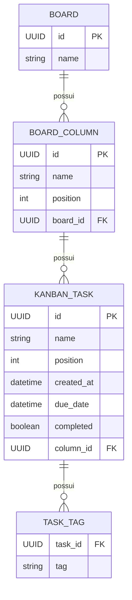

# Proposta de implementação - API Kanban

## 1. Visão geral

Esta proposta adapta o desafio técnico **Todo API**, da Ottimizza, para o
workshop **Do Zero à Cloud: construindo e publicando uma API com Spring Boot**.

O desafio original pede uma API REST em Java e Spring para gerenciar quadros
Kanban, com três recursos (`Board`, `Column` e `Task`), doze endpoints e testes
unitários. Para o workshop, a implementação será incremental: os alunos
entregam primeiro um fluxo vertical completo e os demais endpoints ficam como
extensões. Assim, a atividade preserva o domínio e o contrato do desafio sem
transformar a aula em uma sequência mecânica de CRUDs.

Ao final das duas aulas, cada dupla ou trio deverá conseguir demonstrar:

```text
Frontend público -> API Spring Boot pública -> PostgreSQL
```

## 2. Objetivos de aprendizagem

Ao concluir o workshop, os alunos deverão ser capazes de:

- explicar o papel de controller, service e repository;
- modelar relacionamentos simples com JPA;
- criar uma API REST que recebe e devolve JSON;
- validar dados de entrada e padronizar respostas de erro;
- escrever testes unitários de regras de negócio;
- testar e documentar endpoints com Swagger/OpenAPI;
- configurar uma aplicação para ambientes local e cloud;
- publicar frontend, backend e banco de dados no Railway;
- investigar falhas básicas usando logs e health checks.

## 3. Escopo

### 3.1. Produto completo de referência

A solução do instrutor implementará os doze endpoints descritos no desafio.

| Recurso | Operação | Endpoint |
|---|---|---|
| Board | Listar | `GET /api/v1/board` |
| Board | Criar | `POST /api/v1/board` |
| Board | Atualizar | `PUT /api/v1/board/{boardId}` |
| Board | Excluir | `DELETE /api/v1/board/{boardId}` |
| Column | Listar por quadro | `GET /api/v1/column/from/{boardId}` |
| Column | Criar | `POST /api/v1/column` |
| Column | Atualizar | `PUT /api/v1/column/{columnId}` |
| Column | Excluir | `DELETE /api/v1/column/{columnId}` |
| Task | Listar por coluna | `GET /api/v1/task/from/{columnId}` |
| Task | Criar | `POST /api/v1/task/from/{columnId}` |
| Task | Atualizar | `PUT /api/v1/task/{taskId}` |
| Task | Excluir | `DELETE /api/v1/task/{taskId}` |

### 3.2. Entrega obrigatória dos alunos

O núcleo obrigatório terá sete endpoints:

1. criar e listar quadros;
2. criar e listar colunas de um quadro;
3. criar e listar tarefas de uma coluna;
4. atualizar uma tarefa.

Também fazem parte da entrega:

- validação dos campos obrigatórios;
- resposta `404` para quadro, coluna ou tarefa inexistente;
- ao menos um teste unitário de sucesso e um de erro no `TaskService`;
- teste manual dos endpoints pelo Swagger;
- integração do frontend com a API;
- publicação do backend e do frontend.

### 3.3. Extensões

Grupos que concluírem o núcleo poderão implementar, nesta ordem:

1. exclusão de tarefa;
2. atualização e exclusão de coluna;
3. atualização e exclusão de quadro;
4. ordenação por `position`;
5. cobertura unitária dos demais services;
6. migrations com Flyway;
7. autenticação.

## 4. Decisões de contrato

O PDF é a referência funcional, mas contém pontos que precisam de uma decisão
explícita para evitar comportamentos diferentes entre os grupos.

### 4.1. Compatibilidade com o desafio

- As rotas e os nomes dos campos das responses serão preservados. Os DTOs de
  request serão mais restritos quando um valor pertencer ao servidor.
- Os identificadores serão UUIDs representados como string. Valores como
  `board-1` no PDF são apenas exemplos.
- As respostas de criação e exclusão manterão `200`, como no documento. Durante
  a aula será explicado que `201 Created` e `204 No Content` seriam escolhas
  comuns em um contrato novo.
- Listas serão devolvidas em ordem crescente de `position`.

Essa decisão permite discutir uma prática importante: uma API deve respeitar o
contrato acordado, mesmo quando a equipe escolheria outro desenho em um projeto
novo.

### 4.2. Regras não definidas no PDF

- `Board.name`, `Column.name` e `Task.name` são obrigatórios, sem espaços nas
  extremidades e com no máximo 120 caracteres.
- `position` é um inteiro maior ou igual a zero.
- `createdAt` é preenchido pelo servidor na criação e não pode ser alterado.
- `dueDate` é opcional, mas não pode ser anterior a `createdAt`.
- `completed` assume `false` quando não for informado.
- `tags` assume uma lista vazia e não aceita itens vazios ou duplicados.
- Uma coluna só pode ser criada para um quadro existente.
- Uma tarefa só pode ser criada para uma coluna existente.
- No `POST /task/from/{columnId}`, o valor do path é a fonte de verdade. Se o
  body trouxer `columnId`, os valores deverão coincidir; caso contrário, a API
  responderá `400`.
- No `PUT`, o ID do path é a fonte de verdade e IDs não podem ser alterados.
- A exclusão de um quadro remove suas colunas e tarefas; a exclusão de uma
  coluna remove suas tarefas.

### 4.3. Erros

Os erros serão retornados como `application/problem+json`, usando
`ProblemDetail` do Spring:

```json
{
  "type": "about:blank",
  "title": "Recurso não encontrado",
  "status": 404,
  "detail": "Quadro 7b... não encontrado",
  "instance": "/api/v1/board/7b..."
}
```

Erros de validação também incluirão um objeto `fields` com os campos inválidos.
Um `@RestControllerAdvice` será responsável por manter esse formato consistente.

## 5. Modelo de domínio



As tabelas usarão os nomes `boards`, `board_columns`, `kanban_tasks` e
`task_tags`. Isso evita usar `column` e `task` como identificadores SQL e deixa
claro que o nome da classe Java pode ser diferente do nome físico da tabela.

Os relacionamentos serão bidirecionais apenas se houver uma necessidade real de
navegação. Para o escopo do workshop, referências da entidade filha para a
entidade pai são suficientes e reduzem problemas de serialização e carregamento.
Entidades JPA não serão devolvidas diretamente pelos controllers; requests e
responses terão DTOs próprios.

## 6. Arquitetura da aplicação

Será adotada uma arquitetura em camadas, organizada primeiro por funcionalidade
e depois por responsabilidade:

```text
backend/src/main/java/br/edu/udesc/kanban/
├── board/
│   ├── Board.java
│   ├── BoardController.java
│   ├── BoardRepository.java
│   ├── BoardService.java
│   └── dto/
├── column/
│   ├── BoardColumn.java
│   ├── ColumnController.java
│   ├── ColumnRepository.java
│   ├── ColumnService.java
│   └── dto/
├── task/
│   ├── KanbanTask.java
│   ├── TaskController.java
│   ├── TaskRepository.java
│   ├── TaskService.java
│   └── dto/
├── shared/
│   ├── ApiExceptionHandler.java
│   └── ResourceNotFoundException.java
└── KanbanApplication.java
```

Fluxo de uma requisição:

```text
HTTP/JSON
   |
Controller  -> valida o formato e traduz HTTP
   |
Service     -> executa regras e controla a transação
   |
Repository  -> persiste e consulta
   |
PostgreSQL
```

Responsabilidades:

- **Controller:** rota, status HTTP, validação de request e DTOs;
- **Service:** regras de negócio, existência de entidades e transações;
- **Repository:** consultas e ordenação;
- **Mapper:** conversão entre entidade e DTO, inicialmente com métodos simples;
- **Exception handler:** tradução de exceções para respostas HTTP.

Não serão introduzidos interfaces para todos os services, arquitetura hexagonal
ou bibliotecas de mapeamento no núcleo. São opções válidas, mas adicionariam
abstrações antes de existir complexidade que as justifique.

## 7. DTOs sugeridos

Requests de criação e atualização serão separados das responses. Isso impede
que clientes definam IDs e ajuda a expressar diferenças como `createdAt`
gerenciado pelo servidor.

```java
public record CreateBoardRequest(
    @NotBlank @Size(max = 120) String name
) {}

public record CreateColumnRequest(
    @NotBlank @Size(max = 120) String name,
    @NotNull @PositiveOrZero Integer position,
    @NotNull UUID boardId
) {}

public record CreateTaskRequest(
    @NotBlank @Size(max = 120) String name,
    @NotNull @PositiveOrZero Integer position,
    Instant dueDate,
    Boolean completed,
    List<@NotBlank String> tags,
    UUID columnId
) {}
```

O frontend continuará recebendo `id`, `createdAt` e `columnId` nas responses,
conforme o formato do desafio.

## 8. Persistência e ambientes

### Local

- PostgreSQL instalado nos computadores do laboratório;
- banco `kanban_workshop` e usuário `workshop` preparados antes da aula;
- criação do schema pelo Hibernate para reduzir preparação;
- dados de exemplo opcionais por `data.sql`.

### Cloud

- PostgreSQL gerenciado pelo Railway;
- credenciais exclusivamente por variáveis de ambiente;
- `ddl-auto=update` somente para o workshop;
- Flyway apresentado como evolução para ambientes reais.

Variáveis esperadas:

Local:

```text
DB_URL=jdbc:postgresql://localhost:5432/kanban_workshop
DB_USERNAME=workshop
DB_PASSWORD=workshop
```

As credenciais padronizadas acima serão usadas somente nos computadores do
laboratório. Elas não deverão ser reutilizadas no ambiente público.

Railway:

```text
SPRING_PROFILES_ACTIVE=cloud
SPRING_DATASOURCE_URL=jdbc:postgresql://${{Postgres.PGHOST}}:${{Postgres.PGPORT}}/${{Postgres.PGDATABASE}}
SPRING_DATASOURCE_USERNAME=${{Postgres.PGUSER}}
SPRING_DATASOURCE_PASSWORD=${{Postgres.PGPASSWORD}}
PORT=8080
```

A aplicação deverá usar `server.port=${PORT:8080}` e expor
`/actuator/health` para diagnóstico do deploy.

## 9. Estratégia de testes

O PDF solicita testes unitários para todos os métodos. A solução de referência
cumprirá esse requisito; durante o workshop, os alunos começarão pelo service de
tarefas, onde as regras são mais visíveis.

### Pirâmide proposta

| Camada | Ferramenta | O que verificar |
|---|---|---|
| Service | JUnit 5 + Mockito | regras, chamadas ao repository e erros |
| Controller | `@WebMvcTest` + MockMvc | contrato JSON, validação e status |
| Persistência | `@DataJpaTest` + Testcontainers | consultas e relacionamentos, opcional |
| Fluxo principal | `@SpringBootTest` + Testcontainers | integração do conjunto, opcional |

Casos mínimos do `TaskService`:

- cria tarefa em uma coluna existente;
- rejeita criação quando a coluna não existe;
- rejeita `dueDate` anterior a `createdAt`;
- lista tarefas ordenadas por posição;
- atualiza `completed` sem alterar `createdAt`;
- responde com erro ao atualizar tarefa inexistente.

Não haverá meta artificial de cobertura durante a aula. A avaliação considerará
se os cenários relevantes e as regras de negócio estão protegidos. A solução de
referência poderá usar JaCoCo para tornar lacunas visíveis.

## 10. Starter entregue pelo instrutor

Para preservar tempo de prática, o repositório inicial deverá conter:

- projeto Maven com Java 21 e Spring Boot 4;
- dependências Web, Data JPA, Validation, PostgreSQL, Actuator e OpenAPI;
- profiles `local` e `cloud`;
- Dockerfile;
- CORS liberado para qualquer origem durante o workshop;
- frontend funcional configurado por `VITE_API_URL`, com uma instância por aluno;
- entidades e repositories prontos ou parcialmente prontos;
- um fluxo de `Board` implementado como exemplo;
- um teste unitário de exemplo;
- TODOs pequenos e identificados para os grupos;
- coleção de requests ou Swagger com exemplos.

O instrutor manterá uma branch ou tag com a solução completa. Checkpoints podem
ser distribuídos ao final de cada bloco caso um grupo fique muito atrasado.

## 11. Roteiro de execução

A proposta pressupõe duas aulas. Os tempos abaixo devem ser escalados de acordo
com a duração real, preservando a proporção entre explicação e prática.

### Aula 1 - Do zero à API local

| Bloco | Proporção | Atividade | Checkpoint |
|---|---:|---|---|
| Contexto | 10% | Backend, HTTP, JSON e contrato do desafio | Swagger aberto |
| Arquitetura | 15% | Spring, camadas, DTOs, JPA e validação | Projeto executando |
| Board | 15% | Percorrer o exemplo pronto de ponta a ponta | Board pelo Swagger |
| Column | 20% | Implementação guiada em dupla | Coluna persistida |
| Task | 25% | Implementação pelos grupos | Fluxo principal completo |
| Testes e frontend | 15% | Teste unitário, correções e integração local | Frontend -> API -> PostgreSQL |

### Aula 2 - Da API à cloud

| Bloco | Proporção | Atividade | Checkpoint |
|---|---:|---|---|
| Cloud | 15% | PaaS, containers, variáveis, logs e persistência | Dockerfile entendido |
| Backend | 25% | Publicar a API e acompanhar o build | Health e Swagger públicos |
| Banco | 20% | Criar PostgreSQL e configurar o profile cloud | Dados persistentes |
| Frontend | 20% | Publicar e apontar para a API | Aplicação pública |
| Qualidade | 15% | Testes, erros, CORS e observabilidade | Smoke test concluído |
| Encerramento | 5% | Demonstrações e próximos passos | URLs registradas |

## 12. Critérios de aceite

Uma entrega será considerada concluída quando:

- o projeto compilar e os testes executarem com `./mvnw test`;
- os sete endpoints obrigatórios responderem conforme o contrato;
- relacionamentos inválidos retornarem `404`;
- bodies inválidos retornarem `400` com erro legível;
- tarefas forem persistidas e listadas pela coluna correta;
- ao menos dois testes unitários do `TaskService` passarem;
- o frontend executar um fluxo completo;
- `/actuator/health` estiver acessível no deploy;
- frontend, backend e PostgreSQL estiverem conectados na cloud.

### Smoke test final

1. criar um quadro;
2. criar uma coluna no quadro;
3. criar uma tarefa na coluna;
4. marcar a tarefa como concluída;
5. recarregar o frontend;
6. confirmar que os dados continuam disponíveis.

## 13. Estratégia contra atrasos

Os resultados intermediários são independentes:

1. API local conectada ao PostgreSQL e Swagger;
2. frontend local conectado;
3. API pública conectada ao PostgreSQL do Railway;
4. frontend público conectado.

Se o deploy ou o PostgreSQL do Railway falhar, o grupo demonstra o fluxo
completo no ambiente local. Se o frontend falhar, o Swagger ainda permite
demonstrar o backend. Se a implementação atrasar, o instrutor fornece o
checkpoint anterior, e o grupo continua a partir dele.

## 14. Preparação antes do workshop

- definir duração das aulas, quantidade de alunos e tamanho dos grupos;
- validar Java, Git, Docker e Node nos computadores do laboratório;
- confirmar que o PostgreSQL está ativo e que o banco local aceita conexões com
  as credenciais do workshop;
- testar GitHub e Railway na rede da universidade;
- ensaiar o deploy com uma conta nova;
- congelar e publicar o contrato final da API;
- concluir starter, frontend, solução de referência e checkpoints;
- preparar um roteiro visual curto de deploy;
- deixar uma aplicação de demonstração publicada;
- confirmar limites e condições vigentes do Railway perto da data;
- preparar uma alternativa local caso a rede esteja indisponível.

## 15. Resultado esperado

O workshop não tem como objetivo terminar os doze endpoints a qualquer custo.
Seu resultado principal é fazer o aluno compreender e construir um caminho
vertical completo:

```text
ação no frontend
  -> request HTTP
  -> controller
  -> regra no service
  -> persistência no banco
  -> response JSON
  -> deploy e observação por logs
```

Os cinco endpoints adicionais transformam o mesmo projeto em exercício de
continuidade, enquanto a solução completa do instrutor permanece aderente ao
desafio original.
